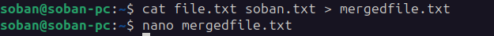

# 					Lab 3

## Task1:

- Create a two files one named file.txt and other is soban.txt

  

- Insert data into files

   

- Merged both files into mergefile.txt

- Output of mergedfile.txt

  

- Display tail and head of the file and soban.txt file respectively

  

- Find rollno from file.txt

  

- Grant the execute permission to the group of soban.txt file

  

- Remove the write permission for the owner of the soban.txt file

  

- Show current location and list files

  

- Make new folder Show him time and he display the Thank You message

  

  ## Task2:

  